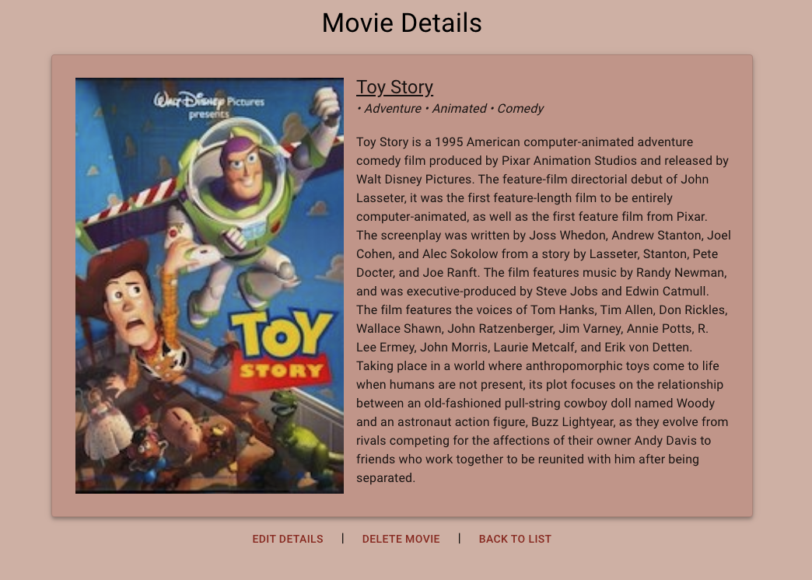
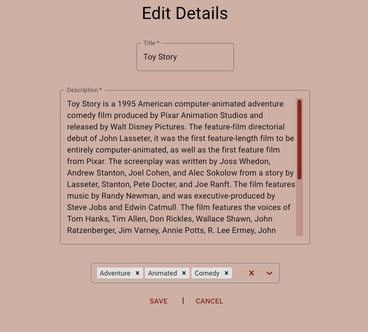

# Movie Sagas

## Description

Duration: 4-5 days of work over a 2 week period

This project contains a list of movies! The movies that are displayed on the movie list page come from a database that was provided to us. This database contains a title, image url, description and a list of genres associated with each movie. The movie list page (`/`) displays the title and image poster of each movie, and the `details` page shows the genres and description. Movies are displayed alphabetically by title. The title, description and genres can be modified by the user on the `edit` page. The `form` page contains a form the user can fill out to add a movie to the database.

## Preview

  

  

  

## Installation / Setup

1. Clone down this repository. You will need `node` and `npm` installed globally on your machine
2. Create a database named `saga_movies_weekend`
3. Run the queries from `database.sql` on the `saga_movies_weekend` database
4. In your editor of choice, run `npm install` in your terminal 
5. Run `npm run server` in your terminal
6. In a new terminal window, run `npm run client`

## Usage

Starting at the home page (movie list), the user can click a movie poster image to be brought to a `details` page containing details for the movie that was clicked on. 

From the details page, the user can click the `Back to List` button to be brought back to the movie list home page or the `Edit Details` button, which will bring them to the `edit` page for that movie. The user can also click the `Delete Movie` button to remove the movie from the database (after confirmation) and be returned to the movie list page.

On the `edit` page, the user can modify the title, description and/or genres of a specific movie using a form and save the changes to the database by clicking the `Save` button. Clicking on the `Cancel` button will cancel any changes made. Both of these buttons will lead the user back to the `details` page.

From any page, the user can click the `Movie Sagas` text or the `Movie List` button in the header to go back to the movie list home page.

Users can click on the `Add Movie` button (located in the header) at any time to be taken to the `form` page. This page contains a form that requires the user to input a title, image URL, description and genre of a movie to be added to the database (more genres can be added from the edit details page). When a user clicks the `Save` button, the movie will be added to the database and displayed on the movie list. The `Cancel` button will lead the user back to the home page.

## Built With

- Javascript
- React
- Redux
- Axios
- MaterialUI
- PostgreSQL
- React-select

## Future Plans

I plan to return to this project in the future and add the ability for users to search/filter through the movie list, add a like to a movie, and display the top 10 liked movies on a separate page. I would also like to update the add movie page with the ability to pick multiple genres for a movie (like the edit details page).

## Acknowledgement

Thanks to Chris Black and Prime Digital Academy for pushing me to go above and beyond my own expectations for this project!

And a special thanks to Marc McCarthy for his help with maintaining my details page on refresh, setting up React-select and providing a ton of inspiration.

## Support

If you run into any issues or have questions/suggestions, please don't hesitate to email me at erichjohnengler@gmail.com.

Thanks for viewing!